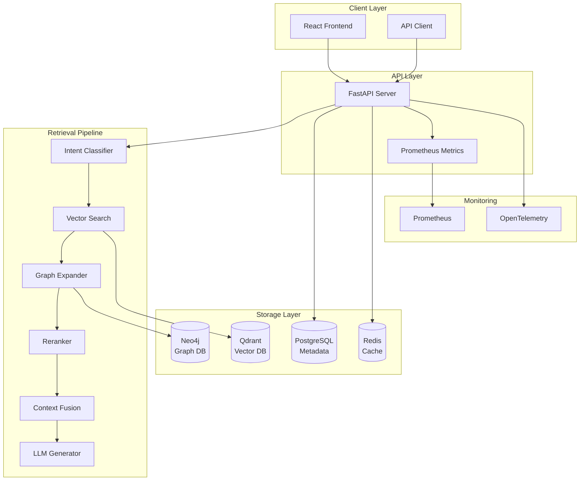
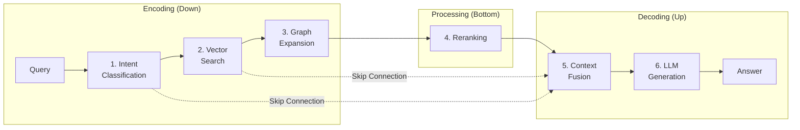
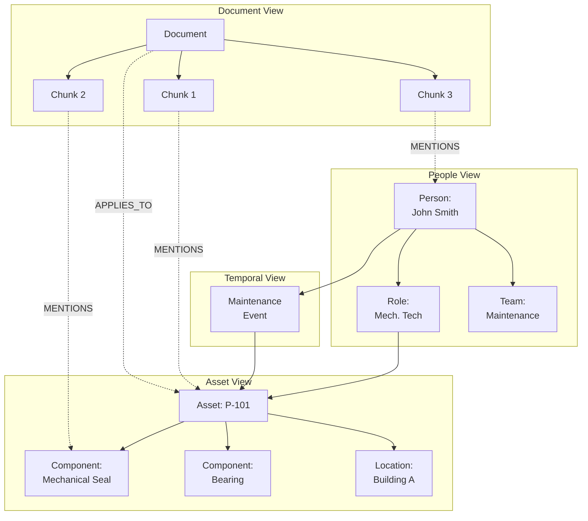
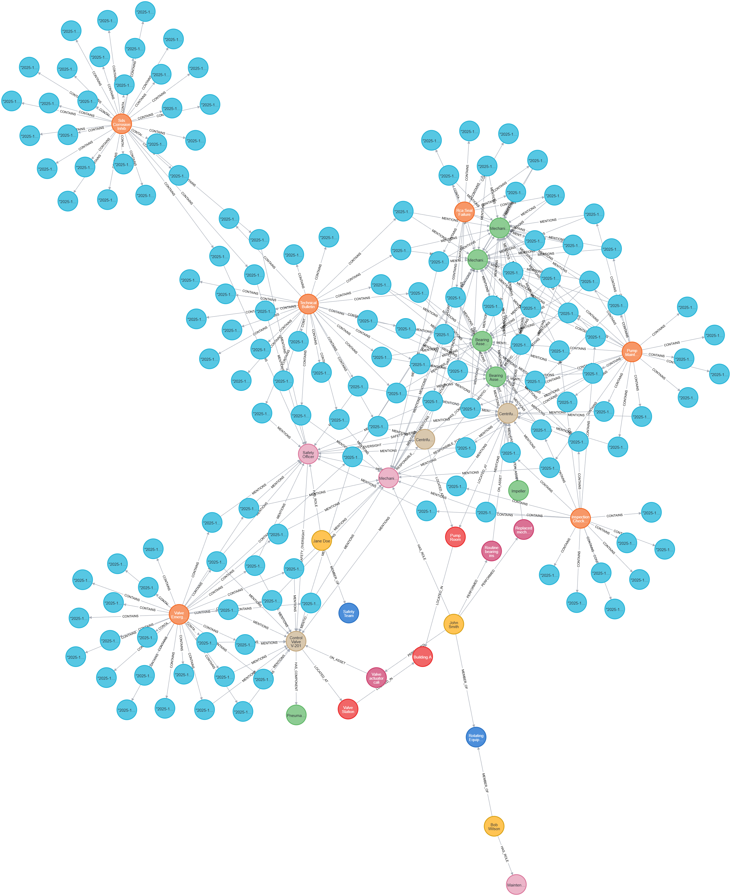

# GraphRAG - Multi-View Knowledge Graph Retrieval System

**Graph-enhanced RAG with hybrid vector + graph search and intent-aware retrieval.**

[](https://www.python.org/downloads/)
[](https://fastapi.tiangolo.com/)
[](https://neo4j.com/)
[](https://qdrant.tech/)

---

## 📋 Table of Contents

- [Overview](#overview)
- [Architecture](#system-architecture)
- [Quick Start](#quick-start)
- [Usage Examples](#usage-examples)
- [Project Structure](#project-structure)
- [Graph Schema](#multi-view-graph-schema)
- [Limitations](#limitations)

---

## 🎯 Overview

GraphRAG is an advanced Retrieval-Augmented Generation system that combines:

- **Multi-view knowledge graphs** (Document, Asset, People, Temporal views)
- **U-shaped retrieval pipeline** with intent classification and graph expansion
- **Vector + Graph hybrid search** for comprehensive context retrieval
- **LLM-based reranking** for improved answer quality

### Key Capabilities

✅ **Intent-Aware Retrieval** - Classifies queries into 5 types (procedure, troubleshooting, safety, asset_info, people)  
✅ **Multi-View Graph Traversal** - Expands context across interconnected knowledge layers  
✅ **Hybrid Search** - Combines vector similarity with graph relationships  
✅ **Session Memory** - Maintains conversation context across queries within a session  
✅ **GPU Acceleration** - Automatic CUDA detection for embedding computation (10-20x speedup over CPU)  
✅ **Fast** - 3-5 second end-to-end latency  
✅ **Docker-based** - Easy local deployment with docker-compose  

---

## 🏗️ System Architecture

### High-Level Architecture



### U-Shaped Retrieval Pipeline



### Multi-View Knowledge Graph



---

## 🧠 Design Rationale

### Hybrid Search (Neo4j + Qdrant)

- **Qdrant**: Semantic similarity via embeddings (finds relevant text)
- **Neo4j**: Relationship traversal (finds connected entities)
- **Combined**: Query "Who maintains P-101?" uses Qdrant for context + Neo4j for `Person → Role → Asset` path

### Multi-View Graphs

Knowledge is organized into 4 specialized views:

- **Document View** – Text structure, chunks, citations
- **Asset View** – Equipment, components, locations
- **People View** – Roles, responsibilities, teams
- **Temporal View** – Maintenance history, inspections

Different query types traverse different views for efficiency.

### Intent-First Retrieval

```
Query → Intent Classification → Specialized Retrieval → Answer
```

Intent is classified first (procedure, troubleshooting, safety, asset_info, people) to select the optimal retrieval strategy for each query type.

### Skip Connections (U-Shaped Pipeline)

```
Intent ─────────────────────────→ Context Fusion
   ↓                                    ↑
Vector Search ─────────────────→       │
   ↓                                    │
Graph Expansion → Reranking ────────────┘
```

Intent and vector scores are preserved through skip connections to prevent information loss.

### Session Memory

Lightweight coreference resolution ("he", "it", "that pump") across conversation turns. Memory is ephemeral (in-memory) and does not modify graph facts.

### Evidence Hierarchy

1. **Graph Facts** – Deterministic, from Neo4j (no citation needed)
2. **Documents** – Supporting evidence, cited as [1], [2]
3. **LLM Reasoning** – Synthesis constrained by graph + documents

---

**Citation Policy:** Factual claims derived directly from the knowledge graph do not require document citations, while inferred or procedural claims are supported with document references.

---

## ✨ Features

### Retrieval Pipeline

| Stage | Technology | Purpose |
|-------|-----------|---------|
| **Intent Classification** | Groq LLM | Categorize query type (5 intents) |
| **Vector Search** | Qdrant + E5-large-v2 | Find semantically similar chunks |
| **Graph Expansion** | Neo4j multi-view | Discover related entities & facts |
| **Reranking** | LLM-based scoring | Improve relevance ranking |
| **Context Fusion** | Skip connections | Combine multi-level context |
| **LLM Generation** | Groq llama-3.1-8b | Generate final answer |

### Multi-View Graphs

- **Document View**: Documents, chunks, concepts, procedures
- **Asset View**: Equipment, components, locations, specifications
- **People View**: Personnel, roles, teams, responsibilities
- **Temporal View**: Maintenance events, inspections, history

### Infrastructure

- **Databases**: Neo4j (graph), Qdrant (vector), PostgreSQL (metadata), Redis (cache)
  - *PostgreSQL* – Stores document metadata, ingestion state, and schema descriptors
  - *Redis* – Caches retrieval results and maintains session-scoped conversation memory
- **Monitoring**: Prometheus metrics, OpenTelemetry tracing
- **Deployment**: Docker Compose (dev)
- **API**: FastAPI with auto-generated docs

---

## 📁 Project Structure

```
c:\Chatbot/
├── graphrag/                      # Core package
│   ├── api/                       # FastAPI endpoints
│   │   ├── main.py               # Main app with health checks
│   │   ├── chat.py               # Simplified chat endpoint
│   │   └── full_pipeline.py      # Full U-shaped pipeline endpoint
│   ├── retrieval/                # Retrieval components
│   │   ├── intent_classifier.py  # Intent classification (5 types)
│   │   ├── graph_expander.py     # Multi-view graph traversal
│   │   ├── reranker.py           # LLM-based reranking
│   │   └── pipeline.py           # U-shaped pipeline orchestration
│   ├── storage/                  # Database clients
│   │   ├── neo4j.py             # Neo4j connection
│   │   ├── qdrant.py            # Qdrant client
│   │   └── postgres.py          # PostgreSQL client
│   └── observability/            # Monitoring
│       └── metrics.py            # Prometheus metrics (20+ metrics)
├── frontend/                     # React UI
│   └── index.html               # Single-page app with pipeline viz
├── config/                       # Configuration
│   ├── prometheus.yml           # Prometheus scrape config
│   ├── otel-collector.yaml      # OpenTelemetry pipeline
│   └── grafana/                 # Grafana dashboards (optional)
├── sample_docs/                  # Sample maintenance documents
│   ├── pump_maintenance_guide.md
│   ├── inspection_checklist.md
│   ├── rca_seal_failure.md
│   ├── sds_corrosion_inhibitor.md
│   ├── technical_bulletin_lubrication.md
│   └── valve_emergency_procedure.md
├── scripts/                     # Setup & utility scripts
│   ├── create_multiview_schema.py   # Create Neo4j schema
│   ├── ingest_docs.py               # Ingest documents to Qdrant + Neo4j
│   └── test_full_pipeline.py        # Comprehensive test suite
├── docker-compose.yml           # All services (6 containers)
├── Dockerfile                   # API container
├── pyproject.toml              # Python dependencies
└── README.md                   # This file
```

### Key Files Explained

**Core Pipeline:**

- `graphrag/retrieval/pipeline.py` - Orchestrates 6-stage U-shaped retrieval
- `graphrag/retrieval/intent_classifier.py` - Classifies queries using LLM
- `graphrag/retrieval/graph_expander.py` - Traverses multi-view graph based on intent
- `graphrag/retrieval/reranker.py` - Reranks chunks using LLM relevance scoring

**API Endpoints:**

- `graphrag/api/full_pipeline.py` - `/api/v1/full/` - Full pipeline with metrics
- `graphrag/api/chat.py` - `/api/v1/chat/` - Simplified fallback endpoint
- `graphrag/api/main.py` - FastAPI app with health checks and CORS

**Data Ingestion:**

- `create_multiview_schema.py` - Creates 29 nodes, 9 relationship types in Neo4j
- `ingest_docs.py` - Chunks documents, embeds with E5, stores in Qdrant + Neo4j

**Frontend:**

- `frontend/index.html` - React app showing 6-stage pipeline visualization

---

## 🚀 Quick Start

### Prerequisites

- **Docker Desktop** (for databases)
- **Python 3.11+**
- **Groq API Key** ([Get free key](https://console.groq.com))

### 1. Clone and Setup

```bash
cd c:\Chatbot

# Create .env file
copy .env.example .env

# Add your Groq API key to .env
# GROQ_API_KEY=your_key_here
```

### 2. Start Services

```bash
# Start all databases (Neo4j, Qdrant, PostgreSQL, Redis, Prometheus, OpenTelemetry)
docker-compose up -d

# Wait 10 seconds for services to initialize
timeout /t 10
```

### 3. Initialize Data

```bash
# Create multi-view graph schema
python scripts/create_multiview_schema.py

# Ingest sample documents
python scripts/ingest_docs.py
```

### 4. Start API

```bash
python -m uvicorn graphrag.api.main:app --reload --port 8000
```

### 5. Test

Open browser:

- **Frontend**: `frontend/index.html`
- **API Docs**: <http://localhost:8000/docs>
- **Prometheus**: <http://localhost:9090>

Or test via command line:

```bash
curl -X POST http://localhost:8000/api/v1/full/ \
  -H "Content-Type: application/json" \
  -d '{"message": "Who is responsible for maintaining pump P-101?"}'
```

**Expected Response:**

```json
{
  "message": "John Smith (Mechanical Technician) is responsible for maintaining Centrifugal Pump P-101.",
  "intent": "people",
  "confidence": 0.817,
  "graph_facts": [
    "John Smith (Mechanical Technician) is responsible for Centrifugal Pump P-101",
    "Centrifugal Pump P-101 has component Mechanical Seal",
    ...
  ],
  "sources": [...],
  "retrieval_steps": [...]
}
```

---

## 🔧 Detailed Setup

### Environment Variables

Create `.env` file:

```bash
# LLM Provider
GROQ_API_KEY=your_groq_api_key_here
GROQ_MODEL=llama-3.1-8b-instant  # Model selection (configurable)

# Database Credentials
NEO4J_URI=bolt://localhost:7687
NEO4J_USER=neo4j
NEO4J_PASSWORD=graphrag123

QDRANT_HOST=localhost
QDRANT_PORT=6333

POSTGRES_PASSWORD=graphrag123
REDIS_PASSWORD=graphrag123

# Optional
GRAFANA_PASSWORD=admin
```

**LLM Model Configuration:**

The `GROQ_MODEL` environment variable controls which model is used for all LLM operations (intent classification, reranking, answer generation):

- `llama-3.1-8b-instant` (default) - Fast, cost-effective
- `llama-3.1-70b-versatile` - Slower, more accurate
- `llama-3.3-70b-versatile` - Latest model

To switch models, simply update `.env` and restart the API - no code changes needed.

### Install Python Dependencies

```bash
pip install -e .
```

Dependencies include:

- `fastapi` - Web framework
- `uvicorn` - ASGI server
- `neo4j` - Graph database client
- `qdrant-client` - Vector database client
- `sentence-transformers` - E5 embeddings
- `groq` - LLM provider
- `prometheus-client` - Metrics
- `httpx` - HTTP client

### GPU Support (Optional)

The system automatically detects and uses CUDA-compatible GPUs for embeddings:

**Performance with GPU** (e.g., NVIDIA RTX 3060):

- Single embedding: ~4-10ms
- Batch of 10: ~40-50ms (4-5ms avg)  
- **10-20x faster than CPU**

**CPU fallback:**

- Single embedding: ~50-100ms
- Batch of 10: ~500-800ms (50-80ms avg)

**No configuration needed** - PyTorch automatically detects CUDA availability. To verify GPU is being used:

```bash
python -c "import torch; print(f'CUDA: {torch.cuda.is_available()}')"
```

### Docker Services

The `docker-compose.yml` includes:

| Service | Image | Ports | Purpose |
|---------|-------|-------|---------|
| **neo4j** | neo4j:5.15-community | 7474, 7687 | Graph database |
| **qdrant** | qdrant/qdrant:v1.7.4 | 6333, 6334 | Vector database |
| **postgres** | postgres:16-alpine | 5432 | Metadata storage |
| **redis** | redis:7-alpine | 6379 | Caching/queuing |
| **prometheus** | prom/prometheus:v2.48.0 | 9090 | Metrics collection |
| **otel-collector** | otel/opentelemetry-collector-contrib:0.91.0 | 4317, 4318, 8889 | Telemetry |

---

## 💡 Usage Examples

> **Note:** Examples use sample maintenance documents (6 docs, 143 chunks) with 3 employees and 3 assets.

### People Query

**Query:** "Who maintains pump P-101?"

```bash
curl -X POST http://localhost:8000/api/v1/full/ \
  -H "Content-Type: application/json" \
  -d '{"message": "Who maintains pump P-101?"}'
```

**Response:**

```json
{
  "message": "John Smith (Mechanical Technician) is responsible for maintaining Centrifugal Pump P-101.",
  "intent": "people",
  "confidence": 0.82,
  "graph_facts": ["John Smith has role Mechanical Technician", "Mechanical Technician responsible for P-101"]
}
```

### Procedure Query

**Query:** "How do I replace the bearing on pump P-101?"

**Response:** Step-by-step bearing replacement procedure with safety notes, PPE requirements, and tool list.

**Graph Facts:** Pump P-101 → has component → Bearing; Bearing replacement → documented in → Pump Maintenance Guide

### Multi-Turn Conversation

```bash
# Turn 1
curl ... -d '{"message": "Who maintains pump P-101?", "session_id": "user-123"}'
# Response: "John Smith (Mechanical Technician)..."

# Turn 2 (with context)
curl ... -d '{"message": "What is his role?", "session_id": "user-123"}'
# Response: "John Smith's role is Mechanical Technician" (remembers context!)
```

### Other Supported Query Types

- **Troubleshooting** – Diagnostic steps, symptom analysis
- **Safety** – PPE requirements, lockout/tagout procedures
- **Asset Info** – Equipment locations, specifications

---

## 📚 API Documentation

### Endpoints

#### POST `/api/v1/full/`

**Full U-shaped retrieval pipeline**

**Request:**

```json
{
  "message": "Who maintains pump P-101?",
  "session_id": "optional-session-id"
}
```

**Response:**

```json
{
  "message": "John Smith (Mechanical Technician) is responsible...",
  "intent": "people",
  "confidence": 0.817,
  "graph_facts": ["fact1", "fact2", ...],
  "sources": [
    {
      "text": "chunk text",
      "score": 0.85,
      "metadata": {...}
    }
  ],
  "retrieval_steps": [
    {
      "stage": "intent_classification",
      "duration_ms": 342,
      "description": "Classified as people query",
      "data": {...}
    },
    ...
  ],
  "session_id": "uuid"
}
```

#### POST `/api/v1/chat/`

**Simplified chat endpoint (fallback)**

**Request:**

```json
{
  "message": "How do I replace a bearing?"
}
```

**Response:**

```json
{
  "message": "To replace a bearing...",
  "sources": [...]
}
```

#### GET `/health/live`

**Liveness probe**

Returns: `{"status": "healthy"}`

#### GET `/health/ready`

**Readiness probe**

Checks database connections, returns: `{"status": "ready", "databases": {...}}`

#### GET `/metrics`

**Prometheus metrics**

Returns metrics in Prometheus format.

---

## 🗺️ Multi-View Graph Schema



### Node Types (29 nodes)

**Document View:**

- `Document` - Source documents
- `Chunk` - Text chunks (143 total)
- `Concept` - Domain concepts

**Asset View:**

- `Asset` - Equipment (P-101, P-102, V-201)
- `Component` - Parts (Mechanical Seal, Bearing, etc.)
- `Location` - Physical locations (Building A, Pump Room, etc.)

**People View:**

- `Person` - Employees (John Smith, Jane Doe, Bob Wilson)
- `Role` - Job roles (Mechanical Technician, Safety Officer, etc.)
- `Team` - Organizational teams (Maintenance Team, etc.)

**Temporal View:**

- `MaintenanceEvent` - Maintenance history
- `Inspection` - Inspection records

### Relationship Types (9 types)

| Relationship | From → To | Purpose |
|--------------|-----------|---------|
| `CONTAINS` | Document → Chunk | Document structure |
| `MENTIONS` | Chunk → Entity | Entity extraction (111 relationships) |
| `APPLIES_TO` | Document → Asset | Document scope |
| `HAS_COMPONENT` | Asset → Component | Asset composition |
| `LOCATED_AT` | Asset → Location | Physical location |
| `HAS_ROLE` | Person → Role | Role assignment |
| `RESPONSIBLE_FOR` | Role → Asset | Responsibility assignment |
| `MEMBER_OF` | Person → Team | Team membership |
| `PERFORMED` | Person → MaintenanceEvent | Work history |
| `SAFETY_OVERSIGHT` | Person → Asset | Safety responsibilities |

> **Note:** Responsibility is modeled via a two-hop path (`Person → Role → Asset`) to decouple organizational roles from individuals. This enables queries like "Who maintains P-101?" to return "John Smith (Mechanical Technician)" with role context.

### Example Graph Queries

**See the full graph:**

```cypher
MATCH (n)
RETURN n
```

**Find all people responsible for an asset:**

```cypher
MATCH (p:Person)-[:HAS_ROLE]->(r:Role)-[:RESPONSIBLE_FOR]->(a:Asset {id: 'P-101'})
RETURN p.name, r.name
```

**Find all documents about an asset:**

```cypher
MATCH (d:Document)-[:APPLIES_TO]->(a:Asset {id: 'P-101'})
RETURN d.title, d.source_file
```

**Find chunks mentioning a component:**

```cypher
MATCH (c:Chunk)-[:MENTIONS]->(comp:Component {name: 'Mechanical Seal'})
RETURN c.text LIMIT 10
```

---

## 📊 Monitoring

**Access Points:**

- **Prometheus UI:** <http://localhost:9090>
- **API Metrics:** <http://localhost:8000/metrics>

**Available Metrics:**

| Metric | Description |
|--------|-------------|
| `graphrag_requests_total` | Total requests by endpoint/status |
| `graphrag_request_latency_seconds` | Request latency (p50, p95, p99) |
| `graphrag_answer_confidence` | Answer confidence distribution |
| `graphrag_llm_tokens_total` | LLM token usage |

---

## ⚠️ Limitations

| Area | Limitation |
|------|------------|
| **Scale** | Tested with 6 sample docs (143 chunks); production validation pending |
| **Tenancy** | Single-tenant only; no auth or user isolation |
| **Language** | English only; no multilingual support |
| **Schema** | Static entity types; requires re-ingestion for changes |
| **Updates** | No real-time sync; documents must be re-ingested |
| **LLM** | Answer generation needs Groq API; embeddings run locally |
| **Memory** | ~500MB for embeddings; session memory lost on restart |
| **Errors** | Basic error handling; no graceful degradation |

**Known Issues:**

- Intent classification may misclassify ambiguous queries
- Confidence scores not calibrated on production data

---

## 🛠️ Development

### Running Tests

```bash
# Full pipeline test (all 5 intent types)
python scripts/test_full_pipeline.py
```

**Expected Output:**

```
✅ Test 1: Procedure query (87.9% confidence, 10 facts)
✅ Test 2: Troubleshooting query (91.6% confidence, 10 facts)
✅ Test 3: Safety query (87.2% confidence, 10 facts)
✅ Test 4: Asset info query (75.5% confidence, 10 facts)
✅ Test 5: People query (81.7% confidence, 10 facts)

✅ All tests passed!
```

### Adding New Documents

1. **Create document** in `sample_docs/`:

```markdown
# New Document Title

Content here...
```

2. **Re-ingest:**

```bash
python ingest_docs.py
```

3. **Verify:**

```bash
# Check Neo4j
curl http://localhost:7474

# Check Qdrant
curl http://localhost:6333/collections/graphrag_chunks
```

### Modifying Graph Schema

Edit `create_multiview_schema.py` and re-run:

```bash
python create_multiview_schema.py
```

### API Development

The API uses hot-reload:

```bash
python -m uvicorn graphrag.api.main:app --reload --port 8000
```

Changes to Python files automatically restart the server.

---

## 🐛 Troubleshooting

### Issue: Qdrant 404 Error

**Symptom:** `404 Not Found` on `/collections/graphrag_chunks/points/search`

**Cause:** Collection not created

**Fix:**

```bash
python ingest_docs.py
```

---

### Issue: Neo4j Connection Error

**Symptom:** `BoltConnectionError: No connection found`

**Cause:** API started before Neo4j or stale connection

**Fix:**

```bash
# Restart API
Get-Process | Where-Object {$_.CommandLine -like "*uvicorn*"} | Stop-Process -Force
python -m uvicorn graphrag.api.main:app --reload --port 8000
```

---

### Issue: No Metrics in Prometheus

**Symptom:** Prometheus shows no data

**Cause:** Prometheus not scraping API correctly

**Fix:**

1. Check `config/prometheus.yml` has `host.docker.internal:8000`
2. Restart Prometheus: `docker restart graphrag-prometheus`
3. Verify target: <http://localhost:9090/targets>

---

### Issue: Graph Facts Empty

**Symptom:** `graph_facts: []` in response

**Cause:** Missing MENTIONS relationships

**Fix:**

```bash
# Re-ingest with entity linking
python ingest_docs.py
```

---

### Issue: Low Confidence Scores

**Symptom:** Confidence < 60%

**Possible Causes:**

- Query ambiguous or unclear
- Insufficient context in documents
- Intent misclassification

**Fixes:**

- Rephrase query to be more specific
- Add more relevant documents
- Check intent classification is correct

---

## 📖 Additional Resources

### Neo4j Visualization

Open Neo4j Browser: <http://localhost:7474>

**Useful Queries:**

```cypher
// View all node types
CALL db.labels()

// view the full graph
MATCH (n)
RETURN n

// View all relationship types
CALL db.relationshipTypes()

// View document structure
MATCH (d:Document)-[:CONTAINS]->(c:Chunk)
RETURN d, c LIMIT 50

// View multi-view connections
MATCH path = (p:Person)-[:HAS_ROLE]->(r:Role)-[:RESPONSIBLE_FOR]->(a:Asset)
RETURN path LIMIT 10
```
